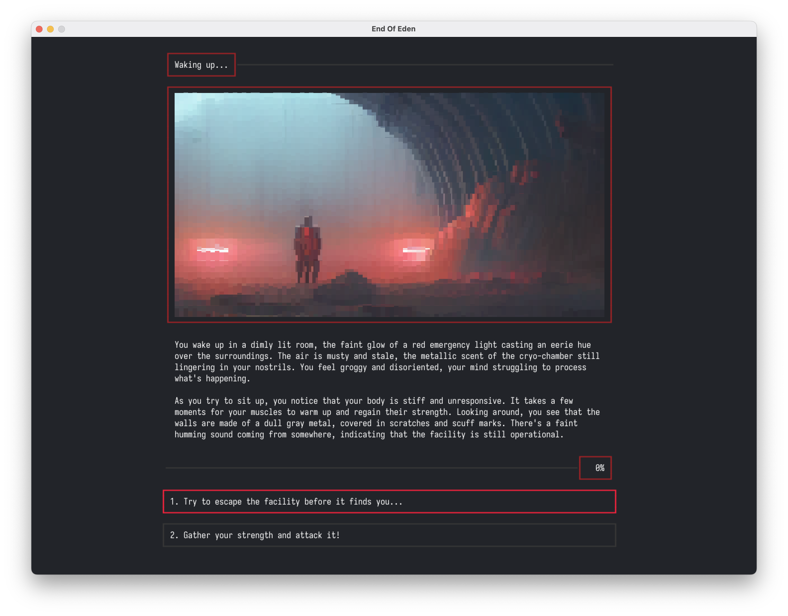

# crt — *cathode-ray tube*



## About

CRT is a library to provide a simple terminal emulator that can be attached to a ``tea.Program``. It uses ``ebitengine`` to render a terminal. It supports TrueColor, Mouse and Keyboard input. It interprets the CSI escape sequences coming from bubbletea and renders them to the terminal.

This started as a simple proof of concept for the game I'm writing with the help of bubbletea, called [End Of Eden](github.com/BigJk/end_of_eden). I wanted to give people who have no clue about the terminal a simple option to play the game without interacting with the terminal directly. It's also possible to apply shaders to the terminal to give it a more retro look which is a nice side effect.

## Usage

```
go get github.com/BigJk/crt@latest
```


```go
package main

import (
	"github.com/BigJk/crt"
	bubbleadapter "github.com/BigJk/crt/bubbletea"
	tea "github.com/charmbracelet/bubbletea"
	"github.com/charmbracelet/lipgloss"
	"image/color"
)

// Some tea.Model ...

func main() {
	// Load fonts for normal, bold and italic text styles.
	fonts, err := crt.LoadFaces("./fonts/SomeFont-Regular.ttf", "./fonts/SomeFont-Bold.ttf", "./fonts/SomeFont-Italic.ttf", crt.GetFontDPI(), 16.0)
	if err != nil {
		panic(err)
	}

	// Just pass your tea.Model to the bubbleadapter, and it will render it to the terminal.
	win, _, err := bubbleadapter.Window(1000, 600, fonts, someModel{}, color.Black, tea.WithAltScreen())
	if err != nil {
		panic(err)
	}

	// Star the terminal with the given title.
	if err := win.Run("Simple"); err != nil {
		panic(err)
	}
}
```

## Limitations

- ~~Only supports TrueColor at the moment (no 256 color support) so you need to use TrueColor colors in lipgloss (e.g. ``lipgloss.Color("#ff0000")``)~~ **Now supported.**
- Not all CSI escape sequences are implemented but the ones that are used by bubbletea are implemented
- Key handling is a bit quirky atm. Ebiten to bubbletea key mapping is not perfect and some keys are not handled correctly yet.
- A lot of testing still needs to be done and there are probably edge cases that are not handled correctly yet

## Credits

- Basic CRT Shader ``./shader/crt_basic``: https://quasilyte.dev/blog/post/ebitengine-shaders/
- Lottes CRT Shader ``./shader/crt_lotte``: Elias Daler https://github.com/eliasdaler/crten and Timothy Lottes.